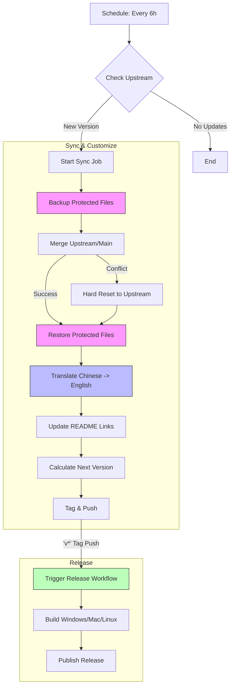

# Antigravity Manager Supreme 🚀

<div align="center">
  

  <h3>Your Personal High-Performance AI Dispatch Gateway</h3>
  <p>Seamlessly proxy Gemini & Claude • OpenAI-Compatible API • Privacy First</p>
  
  > **Fork of [Antigravity Manager](https://github.com/lbjlaq/Antigravity-Manager) with English codebase, YOLO mode, and auto-sync from upstream**
  
  <p>
    <a href="https://github.com/ai-dev-2024/Antigravity-Manager-Supreme/releases/latest"></a>
    <a href="https://github.com/lbjlaq/Antigravity-Manager/releases/latest"></a>
    
    
  </p>

  <p>
    <a href="#-download">📥 Download</a> •
    <a href="#-supreme-features">⚡ Supreme Features</a> •
    <a href="#-quick-start">🚀 Quick Start</a> •
    <a href="#-changelog">📋 Changelog</a>
  </p>
</div>

---

## 🔄 Auto-Sync Workflow

This diagram illustrates how **Antigravity Manager Supreme** automatically stays in sync with the upstream repository while preserving your customizations.



> **Note:** The "Backup & Restore" step ensures features like **Best Accounts**, **Dark Theme**, and **One-Click CLI** are never overwritten.

---

## ⚡ What Makes Supreme Different?

| Feature | Original | Supreme |
|---------|----------|---------|
| **Codebase Language** | Chinese comments | ✅ Full English translation |
| **Auto-Switch on Quota Depletion** | Manual switching | ✅ Automatic account switch + Antigravity relaunch |
| **YOLO Mode (CLI)** | - | ✅ One-command bypass: `yolo` |
| **Combined Quota (Proxy)** | ✅ | ✅ Pools all accounts for CLI |
| **Auto-Sync from Upstream** | - | ✅ Daily sync + auto-translation |

---

## 📥 [Download Latest Release](https://github.com/ai-dev-2024/Antigravity-Manager-Supreme/releases/latest)

> **Key Features:**
> - 🔧 **Auto-Switch**: Automatically switches accounts when quota depletes
> - 🔥 **YOLO Mode**: One-command Claude CLI bypass
> - 🎶 **English Codebase**: All Rust comments translated
> - 🔄 **Auto-Sync**: Syncs with upstream every 6 hours

| Platform | Installer | Status |
|----------|-----------|--------|
| **Windows** | [⬇️ **MSI Installer**](https://github.com/ai-dev-2024/Antigravity-Manager-Supreme/releases/latest) | ✅ Stable |
| **macOS Intel** | [⬇️ **x64 DMG**](https://github.com/ai-dev-2024/Antigravity-Manager-Supreme/releases/latest) | ✅ Stable |
| **macOS Apple Silicon** | [⬇️ **ARM DMG**](https://github.com/ai-dev-2024/Antigravity-Manager-Supreme/releases/latest) | ✅ Stable |
| **Linux** | [⬇️ **AppImage / DEB / RPM**](https://github.com/ai-dev-2024/Antigravity-Manager-Supreme/releases/latest) | ✅ Stable |

## ⚡ Supreme Features

### 🔥 YOLO Mode for Claude CLI
Run Claude CLI without permission prompts in **ANY** terminal:

**CMD / Batch:**
```batch
yolo
```

**PowerShell:**
```powershell
yolo
```

This automatically:
1. Sets up the proxy connection
2. Configures **Claude Opus** for all agents
3. Sets **50 retries** to handle Google rate limits
4. Launches Claude in autonomous mode

> **Setup**: Just enable "YOLO Mode" in the Antigravity Manager Supreme app once.

### 🔄 Auto-Switch (NEW in v1.1.0)
- **Automatic account switching** when quota depletes to 0%
- **Auto-relaunches Antigravity** - continuous operation without manual intervention
- Toggle on/off from Dashboard → Best Accounts section
- Works like CLI proxy pooling, but for the Antigravity app!

### 🔥 YOLO Mode for Claude CLI
Run Claude CLI without permission prompts:
```powershell
# From any project folder:
yolo                    # Starts Claude in YOLO mode
yolo --continue         # Resume last session in YOLO mode
```
> Pre-configured in PowerShell profile. Bypass all tool confirmations.

### 🎛️ Smart Account Dashboard
- Real-time quota monitoring for all accounts
- Best account recommendation with one-click switching
- Active account snapshot with usage percentages

### 🔀 OpenAI-Compatible API Proxy
- **`/v1/chat/completions`** - Works with any OpenAI SDK
- **`/v1/messages`** - Native Anthropic format for Claude CLI/Code
- **Combined Quota** - Pools all 4+ accounts for maximum usage
- Automatic retry and rotation on rate limits

### 🔌 One-Click Client Integration
- **Claude Code (VS Code)** - Set environment variables automatically
- **Claude CLI** - Works immediately after setup
- Auto-sync when config changes

### 🧠 Smart Account Rotation (Proxy)
- Automatic rotation when quota exceeded (429)
- Sticky sessions for conversation continuity
- Rate limit tracking and 5xx-locked account avoidance

### 🔄 Auto-Updates
- Built-in update checker in Settings → About
- One-click download & install

### 🎨 UI Customizations (Supreme Edition)

This fork includes extensive UI/UX improvements over the original:

| Component | Original | Supreme Enhancement |
|-----------|----------|---------------------|
| **Theme** | Basic dark/light | Professional shadcn/ui dark theme with Antigravity-style colors (#1a1f2e) |
| **Buttons** | Standard styling | Consistent `bg-primary`, `bg-card`, `border-border` across all pages |
| **Cards** | Basic containers | Modern cards with `bg-card`, subtle shadows, and hover effects |
| **Tabs** | Default tabs | Pill-style navigation with `bg-primary text-primary-foreground` |
| **Progress Bars** | Basic bars | Themed with `bg-muted` backgrounds |
| **Dashboard** | Standard layout | Enhanced stat cards, best account recommendations |
| **Forms** | Basic inputs | shadcn/ui styled inputs with `border-border` and focus rings |

**Modified Pages:**
- ✅ Dashboard (stat cards, quick links, account display)
- ✅ Accounts (filters, account cards, add dialog)
- ✅ Settings (tabs, forms, theme toggle)
- ✅ API Proxy (controls, status display)
- ✅ Navbar (navigation pills, theme button)

**Multi-language support:** English, 日本語, 中文
**Privacy mode:** Hide account details with one toggle

---

## 🚀 Quick Start

### 1. Install & Launch
Download the installer for your platform above and run it.

### 2. Add Accounts
Go to **Accounts** tab and add your Gemini/Claude accounts via OAuth.

### 3. Start Proxy
Go to **API Proxy** and click **Start Service**.

### 4. Enable Auto-Switch (Optional)
Go to **Dashboard** → find the **Auto-Switch** toggle → enable it to automatically switch accounts when quota depletes.

### 5. Connect Your Apps

**Claude CLI / Claude Code (YOLO Mode):**
```bash
# Use the yolo command (pre-configured):
cd your-project
yolo

# Or with the standard claude command:
claude --dangerously-skip-permissions
```

**Standard Claude CLI:**
```bash
export ANTHROPIC_API_KEY="your-api-key"
export ANTHROPIC_BASE_URL="http://127.0.0.1:8888"
claude
```

**Python (OpenAI SDK):**
```python
import openai

client = openai.OpenAI(
    api_key="your-api-key",
    base_url="http://127.0.0.1:8888/v1"
)

response = client.chat.completions.create(
    model="gemini-2.0-flash",
    messages=[{"role": "user", "content": "Hello!"}]
)
```

---

## 📋 Changelog

### v1.1.10 (2026-01-25) - Auto-Switch & Button Fixes
- 🔧 **Fixed Auto-Switch**: Now properly relaunches Antigravity after switching accounts
- 🔧 **Fixed Best Buttons**: "Best Claude", "Best Gemini", and "Switch to Best" all relaunch Antigravity after switching
- 🧠 **Model-Aware Auto-Switch**: Monitors both Claude & Gemini quotas; switches to the best account for the depleted model
- ➕ **Added `launch_antigravity` Command**: Backend command to close and restart Antigravity

### v1.1.1 (2026-01-08) - Complete English Translation
- ✅ **Full Codebase Translation**: All Rust backend comments translated to English
- ✅ **Cleaned Up Backup Files**: Removed unnecessary backup files
- ✅ **Build Verified**: All features working correctly, no breaking changes
- ✅ **Fixed Dark Mode Toggle**: Improved switch knob visibility

### v1.1.0 (2026-01-08) - Auto-Switch & English Codebase
- ✅ **Auto-Switch**: Automatic account switching when quota depletes + Antigravity relaunch
- ✅ **Full English Codebase**: All Rust code comments translated to English
- ✅ **Rebased on v3.3.17**: Latest upstream features and fixes
- ✅ **YOLO Mode**: Pre-configured PowerShell function for CLI
- ✅ Enhanced quota monitoring with 30-second polling

### v1.0.8 (2026-01-06)
- ✅ Full English localization (UI, logs, code)
- ✅ One-click Claude Code/CLI integration with auto-sync
- ✅ Auto-update system with Check for Updates button
- ✅ CI/CD pipeline with auto-versioning from git tags
- ✅ Multi-platform releases (Windows, macOS Intel/ARM, Linux)

---

## 🔧 Development

```bash
# Clone
git clone https://github.com/ai-dev-2024/Antigravity-Manager-Supreme.git
cd Antigravity-Manager-Supreme

# Install dependencies
npm install

# Run in development
npm run tauri dev

# Build for production
npm run tauri build
```

### English Codebase
All Rust backend code has been translated to English, including:
- `src-tauri/src/proxy/*.rs` - Proxy server, token management, rate limiting
- `src-tauri/src/upstream/*.rs` - Upstream client and retry logic
- `src-tauri/src/utils/*.rs` - HTTP utilities and helpers

---

## 📄 License

**CC BY-NC-SA 4.0** - Non-Commercial Use Only

- ✅ Free for personal use
- ✅ Modifications allowed (share under same license)
- ❌ Commercial use prohibited
- 📋 Attribution required

---

<div align="center">
  <a href="https://ko-fi.com/ai_dev_2024">
    
  </a>
  
  <br><br>
  
  <sub>
    <strong>Fork of <a href="https://github.com/lbjlaq/Antigravity-Manager">Antigravity Manager</a></strong><br>
    Original by <a href="https://github.com/lbjlaq">lbjlaq</a> & Antigravity Team<br>
    Supreme Edition maintained by <a href="https://github.com/ai-dev-2024">ai-dev-2024</a><br>
    Licensed under CC BY-NC-SA 4.0
  </sub>
</div>

