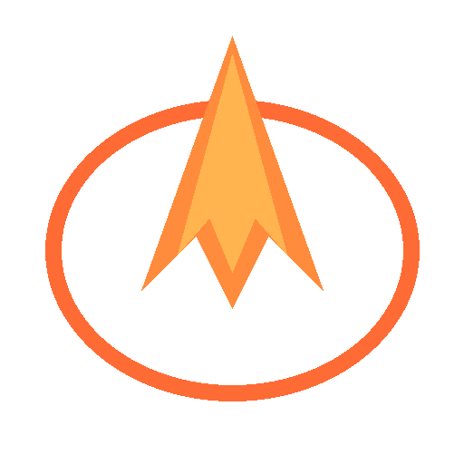

# Antigravity Manager Supreme 🚀

<div align="center">
  

  <h3>Your Personal High-Performance AI Dispatch Gateway</h3>
  <p>Seamlessly proxy Gemini & Claude • OpenAI-Compatible API • Privacy First</p>
  
  > **Fork of [Antigravity Manager](https://github.com/lbjlaq/Antigravity-Manager) — auto-synced every 6 hours, with Supreme branding**
  
  <p>
    <a href="https://github.com/ai-dev-2024/Antigravity-Manager-Supreme/releases/latest"></a>
    <a href="https://github.com/lbjlaq/Antigravity-Manager/releases/latest"></a>
    
    
    <a href="https://startup.z.ai/"></a>
  </p>

  <p>
    <a href="#-download">📥 Download</a> •
    <a href="#-features">✨ Features</a> •
    <a href="#-quick-start">🚀 Quick Start</a> •
    <a href="#-support">💖 Support</a>
  </p>
</div>

---

## 💖 Support

If you find this project useful, please consider supporting the development:

<div align="center">
  <a href="https://ko-fi.com/ai_dev_2024">
    
  </a>
</div>

---

## 📥 Download

| Platform | Installer | Status |
|----------|-----------|--------|
| **Windows** | [⬇️ **EXE** / **MSI**](https://github.com/ai-dev-2024/Antigravity-Manager-Supreme/releases/latest) | ✅ Stable |
| **macOS Apple Silicon** | [⬇️ **ARM64 DMG**](https://github.com/ai-dev-2024/Antigravity-Manager-Supreme/releases/latest) | ✅ Stable |
| **macOS Intel** | [⬇️ **x64 DMG**](https://github.com/ai-dev-2024/Antigravity-Manager-Supreme/releases/latest) | ✅ Stable |
| **Linux** | [⬇️ **AppImage** / **DEB** / **RPM**](https://github.com/ai-dev-2024/Antigravity-Manager-Supreme/releases/latest) | ✅ Stable |

---

## ✨ Features

All features come from [upstream Antigravity Manager](https://github.com/lbjlaq/Antigravity-Manager) — we stay perfectly in sync.

### 🎛️ Smart Account Dashboard
- Real-time quota monitoring for all accounts (Gemini Pro, Flash, Claude, Imagen)
- Best account recommendation with one-click switching
- Active account snapshot with usage percentages

### 🔐 Professional Account Management
- OAuth 2.0 authorization (auto & manual modes)
- Multi-dimensional import (single token, JSON batch, legacy migration)
- 403 Forbidden detection with automatic skip

### 🔀 Protocol Conversion & Relay (API Proxy)
- **OpenAI Format** — `/v1/chat/completions` compatible with 99% of AI apps
- **Anthropic Format** — Native `/v1/messages` for Claude Code CLI
- **Gemini Format** — Direct Google AI SDK support
- Millisecond-level automatic retry and silent account rotation on 429/401

### 🧠 Model Router Center
- Series-based mapping (route GPT-4 requests to Gemini models)
- Regex-level custom model redirects
- Tiered routing by account tier (Ultra/Pro/Free)
- Silent background downgrading for CLI title generation tasks

### 🎨 Multimodal & Imagen 3 Support
- Image generation via OpenAI `size` parameters or model name suffixes
- Payloads up to 100MB for 4K image recognition

### 🔒 Security & Privacy
- Device fingerprint protection
- JA3/BoringSSL fingerprinting via rquest
- All data stays local — no telemetry

---

## 🔄 Auto-Sync Workflow

This fork automatically syncs with [upstream](https://github.com/lbjlaq/Antigravity-Manager) every 6 hours via GitHub Actions.

```
┌─────────────┐     ┌──────────────┐     ┌─────────────────┐     ┌───────────────┐
│  Every 6h   │────▶│ Check latest │────▶│ Checkout fresh  │────▶│ Apply Supreme │
│  (cron)     │     │  upstream    │     │ upstream code   │     │   branding    │
└─────────────┘     └──────────────┘     └─────────────────┘     └───────┬───────┘
                                                                         │
                    ┌──────────────┐     ┌─────────────────┐     ┌───────▼───────┐
                    │   Publish    │◀────│  Tag & push     │◀────│ Clean OAuth   │
                    │   release    │     │  v1.1.X         │     │   secrets     │
                    └──────────────┘     └─────────────────┘     └───────────────┘
```

**What gets preserved:** Workflows, README, icons, branding  
**What gets synced:** All source code, dependencies, configurations

See [SYNC_WORKFLOW.md](./SYNC_WORKFLOW.md) for technical details.

---

## 🚀 Quick Start

### 1. Install & Launch
Download the installer for your platform from the [releases page](https://github.com/ai-dev-2024/Antigravity-Manager-Supreme/releases/latest).

### 2. Add Accounts
Go to **Accounts** tab → add your Gemini/Claude accounts via OAuth.

### 3. Start Proxy
Go to **API Proxy** → click **Start Service**.

### 4. Connect Your Apps

**Claude Code / Claude CLI:**
```bash
export ANTHROPIC_API_KEY="your-api-key"
export ANTHROPIC_BASE_URL="http://127.0.0.1:8888"
claude
```

**Python (OpenAI SDK):**
```python
import openai
client = openai.OpenAI(
    api_key="your-api-key",
    base_url="http://127.0.0.1:8888/v1"
)
response = client.chat.completions.create(
    model="gemini-2.0-flash",
    messages=[{"role": "user", "content": "Hello!"}]
)
```

**Any OpenAI-compatible client:**
```
Base URL:  http://127.0.0.1:8888/v1
API Key:   your-api-key
```

---

## 🔧 Development

```bash
# Clone
git clone https://github.com/ai-dev-2024/Antigravity-Manager-Supreme.git
cd Antigravity-Manager-Supreme

# Install dependencies
npm install

# Run in development
npm run tauri dev

# Build for production
npm run tauri build
```

### Tech Stack
| Layer | Technology |
|-------|-----------|
| **Frontend** | React 19 · TypeScript · Ant Design · @lobehub/ui · TailwindCSS |
| **Backend** | Rust · Axum · SQLite · rquest (JA3 fingerprinting) |
| **Framework** | Tauri v2 |
| **CI/CD** | GitHub Actions — 4-platform build matrix |

---

## 📄 License

**CC BY-NC-SA 4.0** — Non-Commercial Use Only

- ✅ Free for personal use
- ✅ Modifications allowed (share under same license)
- ❌ Commercial use prohibited
- 📋 Attribution required

---

<div align="center">
  <a href="https://ko-fi.com/ai_dev_2024">
    
  </a>
  
  <br><br>
  
  <sub>
    <strong>Fork of <a href="https://github.com/lbjlaq/Antigravity-Manager">Antigravity Manager</a></strong><br>
    Original by <a href="https://github.com/lbjlaq">lbjlaq</a> & Antigravity Team<br>
    Supreme Edition maintained by <a href="https://github.com/ai-dev-2024">ai-dev-2024</a><br>
    Licensed under CC BY-NC-SA 4.0
  </sub>
</div>

