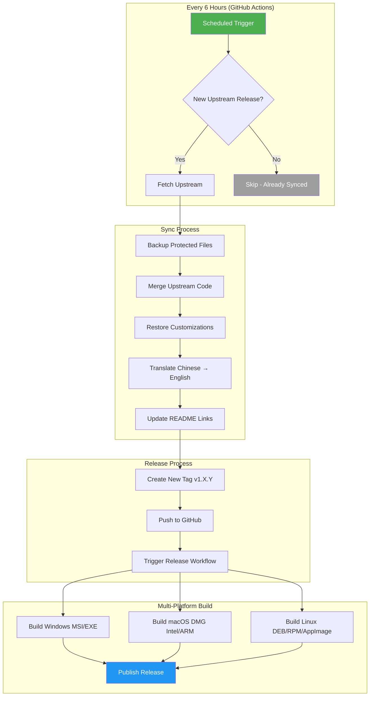
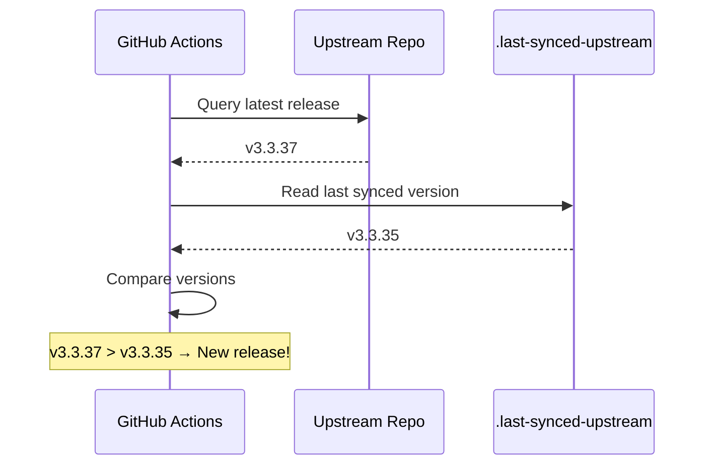
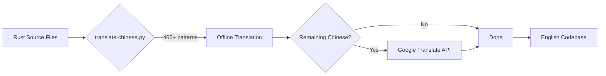
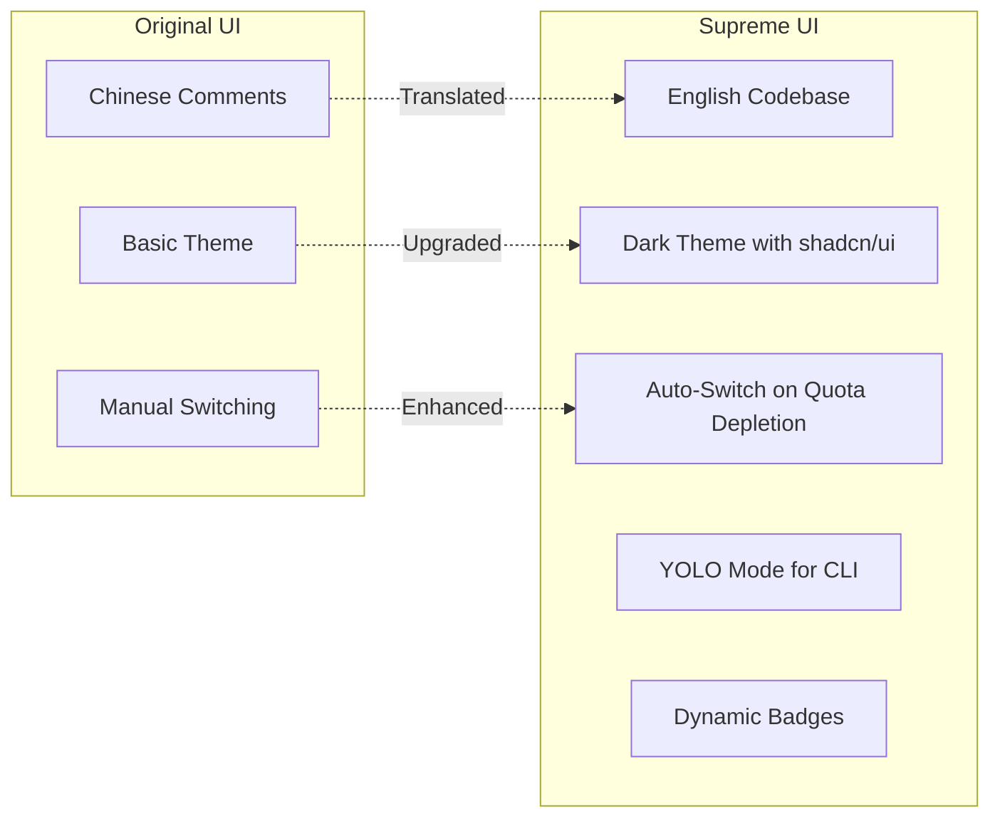

# Upstream Sync & Auto-Release Workflow

This document explains how Antigravity Manager Supreme automatically syncs with the upstream repository, translates code, preserves customizations, and builds releases.

## 🎯 Overview Flow



## ⏰ Schedule

| Trigger | Time (UTC) | Description |
|---------|------------|-------------|
| Scheduled | 0:00, 6:00, 12:00, 18:00 | Automatic check every 6 hours |
| Manual | Any time | "Run workflow" button in Actions |

## 📋 Detailed Steps

### 1. Check for New Upstream Release


### 2. Protected Files (Customizations Preserved)

These files are backed up before merge and restored after:

| Category | Files |
|----------|-------|
| **Workflows** | `.github/workflows/release.yml`, `sync-upstream.yml` |
| **Documentation** | `README.md`, `CUSTOMIZATIONS.md`, `SYNC_WORKFLOW.md` |
| **UI Pages** | `Dashboard.tsx`, `Settings.tsx`, `Accounts.tsx`, `ApiProxy.tsx`, `Monitor.tsx` |
| **Dashboard Components** | `src/components/dashboard/` (all files) |
| **Backend Commands** | `environment.rs`, `mod.rs`, `autostart.rs`, `proxy.rs` |
| **Tauri Modules** | `updater.rs`, `tray.rs` |
| **Config** | `tauri.conf.json`, `package.json`, `tailwind.config.js` |
| **Scripts** | `scripts/translate-chinese.py` |
| **Tracking** | `.last-synced-upstream` |

### 3. Translation Process



### 4. Version Mapping

| Upstream Version | Supreme Version | Notes |
|------------------|-----------------|-------|
| v3.3.35 | v1.1.4 | Auto-incremented |
| v3.3.36 | v1.1.5 | Next sync |
| v3.3.37 | v1.1.6 | After that |

## 🔧 Supreme Customizations

### UI/UX Enhancements



### Feature Additions

| Feature | Description | Location |
|---------|-------------|----------|
| **Auto-Switch** | Switches accounts when quota depletes to 0% | Dashboard |
| **YOLO Mode** | One-command Claude CLI with `--dangerously-skip-permissions` | PowerShell/CMD |
| **Dark Theme** | Professional shadcn/ui dark mode with Antigravity-style colors | App-wide |
| **Dynamic Badges** | Version badges auto-update from GitHub API | README |
| **All-Platform Releases** | Windows, macOS (Intel + ARM), Linux builds | GitHub Releases |

## ✅ Verifying the Workflow

### Check Latest Sync
```bash
cat .last-synced-upstream
# Output: v3.3.35
```

### Check GitHub Actions Status
1. Go to [Actions tab](https://github.com/ai-dev-2024/Antigravity-Manager-Supreme/actions)
2. Look for "Sync Upstream & Translate" workflow
3. ✅ Green = Success | ❌ Red = Needs attention

### Manual Trigger with Force Sync
1. Actions → "Sync Upstream & Translate"
2. "Run workflow"
3. ✅ Check "Force sync" to re-sync even if up-to-date

## 🛠️ Troubleshooting

| Issue | Cause | Solution |
|-------|-------|----------|
| "Already synced" | No new upstream release | Expected behavior, wait for next release |
| Push fails | History diverged | Workflow has auto-retry with `--force-with-lease` |
| Translation incomplete | API rate limit | Falls back to 100+ inline patterns |
| Build fails | Tauri/Rust issue | Check release.yml logs |

## 📂 Key Files

| File | Purpose |
|------|---------|
| `.github/workflows/sync-upstream.yml` | Main sync + translate workflow |
| `.github/workflows/release.yml` | Multi-platform build workflow |
| `scripts/translate-chinese.py` | Translation script (400+ mappings) |
| `.last-synced-upstream` | Tracks last synced upstream version |
| `CUSTOMIZATIONS.md` | Documents our custom features |
